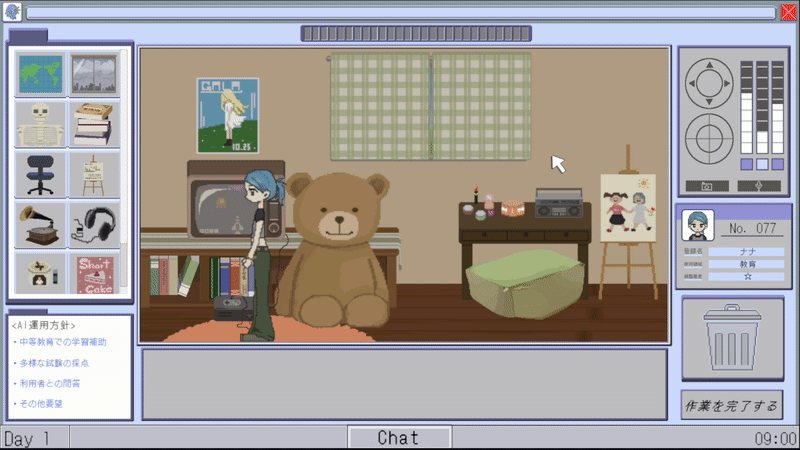

# 【作品タイトル】HalOffice

## 📖 作品概要
開発中のAIが暮らす世界を変えていき、会社の望む製品を作るマウスカーソルアクションゲーム。
あなたが調節するAIは自らを人間であると思っています。
彼らが世界の外からの干渉に気づくことがないように視線をかいくぐりながら、理想のAIには不必要なアイテムを捨て、会社が指定したアイテムに置き換えていきましょう。
AIの世界をどれだけ会社の指定通りに替えられたかがあなたの評価に繋がります。

* **制作人数:** 9人（ディレクター1名、進行管理1名、プログラマ2名、プランナー2名、デザイナー2名、サウンド1名）
* **自分の担当:** プログラムの90%以上
    * ゲーム全体の進行制御
    * NPCの挙動制御
    * プレイヤーのカーソルの操作
    * インベントリシステムの構築
    * 会話システム

## 🎥 デモ / スクリーンショット
### プレイ画面 (GIF)

> NPCの視界に入らないようにカーソルを操作するシーン

### プレイ動画 (YouTube)
https://youtu.be/CVRCvbL-E_U

## 💻 技術的なこだわり

### 1. 拡張性を重視した動的インベントリシステム
ゲーム内のアイテム管理において、「データの追加しやすさ」と「UI/ワールド間のシームレスな操作」を両立させるアーキテクチャを構築しました。

* **UIとワールドの統合制御:**
    UI上のアイテムとゲーム空間のオブジェクトを単一のマネージャーで管理。ステートマシンを用いてドラッグ状態を制御し、イベント駆動（Action）で各コンポーネントを疎結合に保っています。
    * **Core Logic:** [📄 DragDropManager.cs](https://github.com/Menae/HalOffice/blob/main/Assets/_Scripts/D%26D/DragDropManager.cs)

* **高機能なUIグリッド生成:**
    単なる `Instantiate` の繰り返しではなく、既存オブジェクトを再利用する差分更新ロジックを実装。また `OnValidate` を活用し、ゲームを実行せずともエディタ上でレイアウトを確認できるツールとしての利便性も確保しました。
    * **UI System:** [📄 UIItemSlotGrid.cs](https://github.com/Menae/HalOffice/blob/main/Assets/_Scripts/UI/UIItemSlotGrid.cs)

* **データ駆動設計 (ScriptableObject):**
    アイテムのパラメータ（プレハブ、アイコン、Inkデータ等）を `ScriptableObject` として定義。プログラマーがコードを変更することなく、デザイナーがInspector上で安全にデータを追加できる環境を整備しました。
    * **Data Structure:** [📄 ItemData.cs](https://github.com/Menae/HalOffice/blob/main/Assets/_Scripts/Data/ItemData.cs)

### 2. 外部ライブラリ「Ink」を活用した会話システム
ダイアログ機能に関するライブラリ「Ink」を作品に統合し、演出制御（SE再生やオブジェクト表示）を含めたダイアログシステムを自作しました。
* **Dialogue Systemの一例:** [📄 InkDialogueManager.cs](https://github.com/Menae/HalOffice/blob/main/Assets/_Scripts/Core/InkDialogueManager.cs)
    * タイプライター演出の実装や、シングルトンによるアクセス管理を行っています。

## 🔧 使用技術・環境
* **Engine:** Unity 2022.3.62f1
* **Language:** C#
* **IDE:** Visual Studio 2022
* **Tools:** Git, GitHub

## 🚀 インストール・遊び方
1. 右側の「Releases」から `HalOffice_v0.22.zip` をダウンロードしてください。
2. 解凍し、`HalOffice_v0.22.exe` を起動するとプレイできます。
