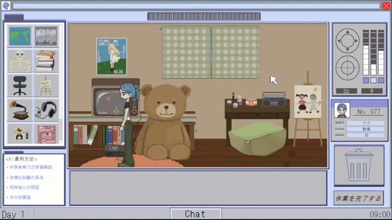

# 【作品タイトル】HalOffice

## 📖 作品概要
開発中のAIが暮らす世界を変えていき、会社の望む製品を作るマウスカーソルアクションゲーム。
あなたが調節するAIは自らを人間であると思っています。
彼らが世界の外からの干渉に気づくことがないように視線をかいくぐりながら、理想のAIには不必要なアイテムを捨て、会社が指定したアイテムに置き換えていきましょう。
AIの世界をどれだけ会社の指定通りに替えられたかがあなたの評価に繋がります。

* **制作人数:** 9人（ディレクター1名、進行管理1名、プログラマ2名、プランナー2名、デザイナー2名、サウンド1名）
* * **制作期間:** 2025年6月〜（現在も開発中）
* **自分の担当:** プログラムの90%以上
    * ゲーム全体の進行制御
    * NPCの挙動制御
    * プレイヤーのカーソルの操作
    * インベントリシステムの構築
    * 会話システム

## 🎥 デモ / スクリーンショット
### プレイ画面 (GIF)

> NPCの視界に入らないようにカーソルを操作するシーン

### プレイ動画 (YouTube)
https://youtu.be/CVRCvbL-E_U

## 💻 技術的なこだわり

### 1. UI/ワールド統合型ドラッグ＆ドロップシステム (DragDropManager)
インベントリ（UI/スクリーン座標）からゲームフィールド（ワールド座標）へ、アイテムを直感的に持ち出せる操作系を実装しました。
異なる座標系やレンダリングレイヤーを意識させない、シームレスなUXの実現に注力しています。

* **スクリーン空間とワールド空間の相互運用**
  uGUI要素である `UIDraggable` と、ゲーム内オブジェクトである `Draggable` を統一的に扱うステートマシンを構築。UI上のアイテムをドラッグしてフィールドにドロップした瞬間に、プレハブを実体化して配置するという「2D→3D(World)」への変換プロセスを実装しました。
* **視覚的フィードバック（プロキシ）パターン**
  ドラッグ中は元のオブジェクトを移動させるのではなく、最前面レイヤーに生成した「プロキシ（代理描画）」を追従させる設計を採用。これにより、アイテムが指やカーソルで隠れることを防ぎつつ、ドロップ判定が確定するまでゲーム状態を汚染しない安全な操作を実現しています。
* **ハイブリッド・レイキャスト判定**
  ドロップ先の検知において、Unity標準の `EventSystem`（UI判定）と `Physics2D.OverlapPoint`（物理判定）を複合的に処理するメソッド `FindDropZoneUnderCursor` を実装。UIの重なり順や物理コライダーの有無に関わらず、ユーザーが意図した最前面のオブジェクトを正確に取得します。
    * **Core Logic:** [📄 DragDropManager.cs](https://github.com/Menae/HalOffice/blob/main/Assets/_Scripts/D%26D/DragDropManager.cs)

### 2. 仕様変更に即応するレスポンシブ・グリッドシステム (UIItemSlotGrid)
開発中の頻繁な仕様変更（アイテム数の増減やデザイン変更）にコード修正なしで対応できる、柔軟なインベントリ表示システムです。
「手動配置の手間をゼロにする」ことを目標に、レイアウトの自動計算とエディタ拡張に注力しました。

* **動的な差分更新ロジック**
  アイテムスロットの生成において、全削除＆再生成ではなく「不足分のみ生成／過剰分のみ削除」を行う差分更新アルゴリズムを実装。実行時の負荷を抑えつつ、動的なインベントリサイズの変更にリアルタイムで追従します。
* **画面幅に合わせるオートフィッティング**
  デバイスの解像度や親パネルの幅に応じて、スロットのサイズを自動計算するレスポンシブ機能を実装。`fitCellWidthToViewport` フラグにより、列数を維持したまま余白なく配置されるよう `GridLayoutGroup` を動的に制御し、あらゆるアスペクト比で崩れないUIを実現しました。
* **エディタワークフローの最適化**
  Unityエディタの `OnValidate` イベントをフックし、Inspector上の数値を変更するだけで即座にシーンビュー上のレイアウトへ反映。ゲームを再生することなくデザイン調整が可能で、UI構築の試行錯誤にかかる時間を大幅に短縮しました。
    * **UI System:** [📄 UIItemSlotGrid.cs](https://github.com/Menae/HalOffice/blob/main/Assets/_Scripts/UI/UIItemSlotGrid.cs)

### 3. テキストデータ駆動型イベント演出システム (StartupSequenceManager / DesktopManager / TutorialManager)
会話エンジン「Ink」のタグ機能を拡張し、シナリオテキスト側からUnity上のオブジェクト（キャラクター移動、アニメーション、UIハイライト）を直接制御できるスクリプティング環境を構築しました。
「プログラマの手を介さずに演出調整が可能」なデータドリブン設計を意識しています。

* **タグ解析による動的演出制御**
  テキストデータ内に埋め込まれた独自タグ（`#move_char`, `#play_anim`, `#highlight`）をランタイムで解析し、対応するUnity上のメソッドをリフレクション的に実行。シナリオライターがテキストエディタ上で演出のタイミングや対象を指定できるワークフローを実現しました。
* **コルーチンによる並列コマンド実行**
  演出タグ処理において、複数の命令（例：「歩きながら」「喋る」）を同時に実行できるよう、`StartCoroutine` のインスタンスをリスト管理し、全コマンドの完了を動的に待機する非同期制御を実装。リニアな会話進行の中に、複合的な演出をシームレスに組み込んでいます。
* **OS模倣UIのステート管理**
  「ログイン画面 → デスクトップ → アプリ起動」というOSのような階層構造をUnity UIで再現。各ウィンドウのフォーカス制御や、通知バッジの動的生成、アプリアイコンのホバーエフェクト（単一のフレームオブジェクトを使い回す最適化実装）など、インタラクティブなUIを構築しました。
    * [📄 StartupSequenceManager.cs](https://github.com/Menae/HalOffice/blob/main/Assets/_Scripts/Core/StartupSequenceManager.cs)
    * [📄 DesktopManager.cs](https://github.com/Menae/HalOffice/blob/main/Assets/_Scripts/UI/DesktopManager.cs)
    * [📄 TutorialManager.cs](https://github.com/Menae/HalOffice/blob/main/Assets/_Scripts/Core/TutorialManager.cs)

### 5. 高機能会話エンジンラッパー (DialogueManager)
オープンソースの会話エンジン「Ink」をUnityに統合し、選択肢分岐やタグベースの演出制御を含む高度な会話システムを実装しました。
「読む」だけでなく「体験する」会話シーンを作るための拡張性と、UXへの細やかな配慮を両立しています。

* **イベント駆動型のタグ処理システム**
  Inkのタグ機能（`#speaker:A` など）を解析し、`Action<List<string>>` イベントとして発行する設計を採用。これにより、会話マネージャー自体を変更することなく、キャラクターの表情変化やSE再生といった演出ロジックを別クラスで自由に拡張できる疎結合な構造を実現しました。
* **ステートベースの入力制御**
  「テキスト送り中」「選択肢待機中」「演出再生中」といった会話の状態を厳密に管理し、プレイヤー入力の可否やカーソル表示（レトロゲーム風のアニメーション付き）を動的に制御。バグの起きやすい非同期処理において、堅牢な排他制御を実装しています。
* **タイプライター演出とスキップ機能**
  コルーチンによる1文字ずつの表示演出と、入力による一括表示（スキップ）機能を実装。文字送りと同期したSE再生機能も備え、テキストアドベンチャーゲームとしての基本的な手触りを高水準で実現しました。
* **Dialogue Systemの一例:** [📄 DialogueManager.cs](https://github.com/Menae/HalOffice/blob/main/Assets/_Scripts/Core/DialogueManager.cs)

## 🔧 使用技術・環境
* **Engine:** Unity 2022.3.62f1
* **Language:** C#
* **IDE:** Visual Studio 2022
* **Tools:** Git, GitHub

## 🚀 インストール・遊び方
1. 右側の「Releases」から `HalOffice_v0.22.zip` をダウンロードしてください。
2. 解凍し、`HalOffice_v0.22.exe` を起動するとプレイできます。
